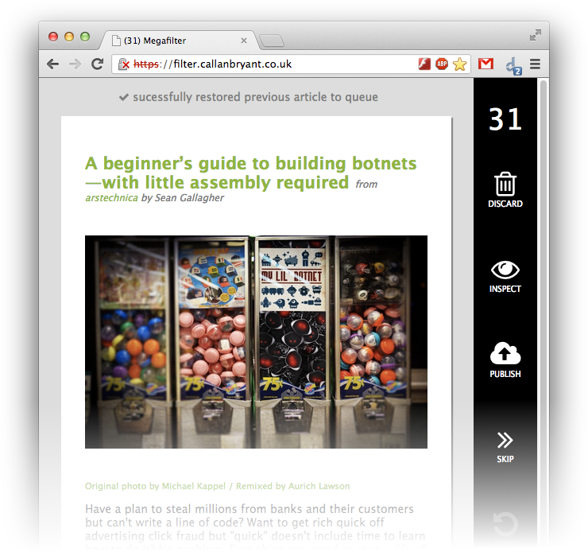

This is a personal replacement for Google reader. It's simple and suits my workflow.

[See my blog post about it][2].

[2]: http://callanbryant.co.uk/#Blog

Remember to do a recursive clone, there are submodules. If you don't the icons won't work.

	git clone --recursive https://github.com/naggie/megafilter.git
	cd megafilter/
	# copy subscriptions.xml from your google reader takeout to here
	npm install
	node app
	open http://localhost:8080

The idea is that you run this on your own server. You can specify a PORT via
the environment variable or `--port`. [Setcap can be used][1] to run from port 80 without sudo

There will be a subscriptions manager soon.

You can specify `--password <password>` to require auth. A `--username` can be
set, but this defaults to the executing user.

If you want to import starred items, **before the server is started,** run:

	node import --google-starred starred.json

using the file from the takeout.

[1]: http://stackoverflow.com/questions/413807/is-there-a-way-for-non-root-processes-to-bind-to-privileged-ports-1024-on-l

RESTful JSON API
----------------

> `GET /next`
Get the next article. Returns `article` and `pending` count.

> `GET /current`
Get the current article (good for first load) returns `article` and `pending` count.

> `DELETE /queue/:id`
Discard an article from the queue.

> `PUT /publish/:id`
Publish an article by ID from the queue.

> `GET /published`
Given a `count` as parameter, return published articles. 0 Means all articles, unspecified  means 30.

> `GET /pending`
Gives the current number of articles pending

> `DELETE /published/:id`
Delete an article from the published collection

> `POST /enqueue`
Remotely adds an article to the queue.

Article format
--------------

The same as the node-feedparser format.

* `title`
* `description` (frequently, the full article content)
* `summary` (frequently, an excerpt of the article content)
* `link`
* `origlink` (when FeedBurner or Pheedo puts a special tracking url in the `link` property, `origlink` contains the original link)
* `date` (most recent update)
* `pubdate` (original published date)
* `author`
* `guid` (a unique identifier for the article)
* `comments` (a link to the article's comments section)
* `image` (an Object containing `url` and `title` properties)
* `categories` (an Array of Strings)
* `source` (an Object containing `url` and `title` properties pointing to the original source for an article; see the [RSS Spec](http://cyber.law.harvard.edu/rss/rss.html#ltsourcegtSubelementOfLtitemgt) for an explanation of this element)
* `enclosures` (an Array of Objects, each representing a podcast or other enclosure and having a `url` property and possibly `type` and `length` properties)
* `meta` (an Object containing all the feed meta properties; especially handy when using the EventEmitter interface to listen to `article` emissions)

